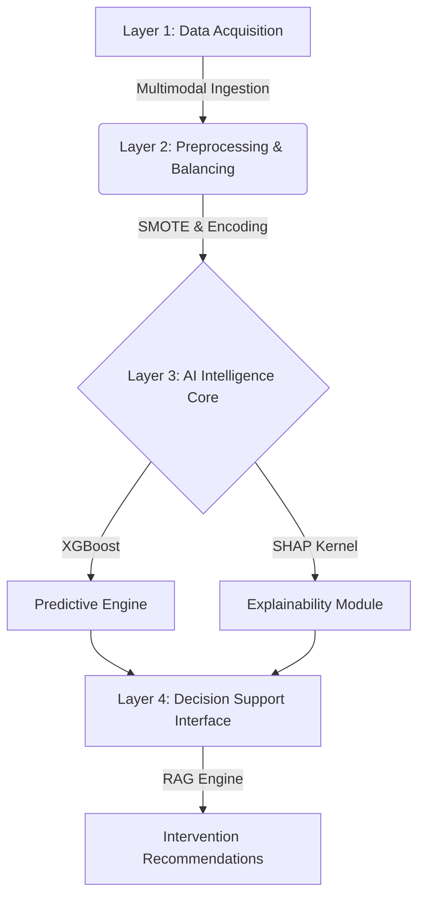

# 🧠 AI-Driven Preventive Decision Support System

### *For Perinatal Mental Health & Risk Stratification*

> **Research Focus:** Shifting maternal mental health care from *Reactive Postpartum Detection* to **Proactive Antenatal Prevention**.

---

## 📄 Abstract

Maternal mental health disorders, specifically perinatal depression, remain a critical public health challenge due to reactive screening methods that often delay diagnosis until the postpartum period.

This project presents a **Preventive Decision Support System (DSS)** that leverages machine learning to predict depression risk during the **antenatal (pregnancy) stage**. Unlike traditional models that rely solely on static demographics, this system integrates:

* 🕒 **Temporal Gestational Markers**
* 💤 **Behavioral Proxies** (Sleep, Appetite, Fatigue)
* 🔍 **Explainable AI (SHAP)** for clinical transparency
* 🛡️ **Retrieval-Augmented Generation (RAG)** for evidence-based intervention

---

## 🚩 Problem Statement

Existing AI solutions for maternal mental health suffer from **four critical limitations** identified in recent literature:

| Problem Area | The Current Limitation |
| --- | --- |
| **Reactive Focus** | Primarily targets Postpartum Depression (PPD) *after* childbirth. |
| **Black-Box Nature** | Lacks interpretability, reducing clinician trust in predictions. |
| **Unimodal Data** | Relies on static sociodemographics, ignoring dynamic behaviors. |
| **Non-Actionable** | Provides risk scores without offering safe, targeted interventions. |

---

## 💡 Proposed Solution & Novelty

This system introduces a **Stage-Aware, Multimodal Framework** designed to bridge the gap between screening and treatment.

### Key Novel Features

#### 1. 🔮 Dynamic Antenatal Risk Profiler

Utilizes `Gestational Age` as a temporal proxy to calculate risk trajectories throughout pregnancy, serving as an **Early Warning System** rather than a diagnosis tool.

#### 2. 🧩 Behavioral Digital Phenotyping

Extracts functional health signals from clinical questionnaires to refine risk estimation:

* *Sleep Architecture (Insomnia/Hypersomnia)*
* *Anhedonia Indicators*
* *Nutritional Dysregulation*

#### 3. 🧠 XAI (Explainable AI) Inspector

Deploys **SHAP (SHapley Additive exPlanations)** to decompose risk scores.

> *"The system visualizes exactly why a patient is High Risk (e.g., '80% driven by sleep loss, 20% by financial stress')."*

#### 4. 🛡️ RAG-Based Intervention Assistant

A **"Knowledge-Grounded"** engine that retrieves WHO/ACOG guidelines to generate safe, context-aware recommendations based on identified risk drivers.

#### 5. ⚖️ Human-in-the-Loop (HITL) Validation

An active learning interface allowing clinicians to validate or correct AI predictions, mitigating **algorithmic drift** and **alert fatigue**.

---

## 🏗️ System Architecture

The software is designed in a modular **Four-Layer Architecture**:



---

## 📊 Dataset Description

The model is trained and validated on a structured clinical dataset focusing on perinatal mental health.

* **Primary Source:** `oversampled_data.csv` (Synthetic oversampling applied for robustness).
* **Sample Size:** ~24,000 records.
* **Target Variable:** `Labelling` (Depression Severity Class).

### Feature Breakdown

* **Temporal:** `Gestational Age`
* **Behavioral:** `Trouble falling or staying sleep`, `Poor appetite`, `Feeling tired`
* **Socio-Environmental:** `Sufficient Money for Basic Needs`, `Relationship with Mother-in-law`

---

## 🛠️ Technology Stack

* **Language:** Python 3.9+ 🐍
* **Machine Learning:** XGBoost, Scikit-Learn, Imbalanced-Learn (SMOTE)
* **Explainability:** SHAP (SHapley Additive exPlanations)
* **Data Processing:** Pandas, NumPy
* **Visualization:** Matplotlib, Seaborn
* **Generative AI (Proposed):** LangChain + OpenAI/LlamaIndex (for RAG module)

---

## 🚀 Installation & Usage

### 1. Clone the Repository

```bash
git clone https://github.com/your-username/perinatal-depression-dss.git
cd perinatal-depression-dss

```

### 2. Install Dependencies

```bash
pip install pandas numpy scikit-learn matplotlib seaborn shap imbalanced-learn

```

### 3. Run the Training Pipeline

To train the XGBoost model and generate performance metrics:

```bash
python src/train_model.py

```

---

## 📈 Performance Metrics (Preliminary)

* **Algorithm:** XGBoost Classifier (`n_estimators=300`)
* **Accuracy:** **~88%** (on validation set)
* **Precision (High Risk Class):** 0.87
* **Recall (High Risk Class):** 0.88

> **Key Insight:** Feature importance analysis confirms that *Behavioral Proxies* (Sleep, Fatigue) and *Gestational Age* significantly outweigh static demographic factors in predicting risk.

---

## 🔁 Reproducibility Protocol

All experiments use:

- `random_state = 42`
- Stratified `80/20` split
- SMOTE oversampling applied only on training set

Reproducibility controls:

- Fixed feature ordering is enforced by `DEFAULT_FEATURES` and stored in model metadata.
- Training metrics include exact dataset hash (`SHA-256`) and the split/seed configuration.
- Training metrics log exact dependency versions for `scikit-learn`, `xgboost`, and `shap`.

The metadata is written to:

- `webapp/backend/model/metrics/risk_metrics.json`

---

## ⚖️ Fairness Evaluation Protocol

- Operational fairness is reported at `positive_threshold = 60` (clinical triage operating point).
- To avoid threshold-specific bias claims, disparate impact is additionally reported across multiple thresholds (`40/50/60/70`).
- A threshold-free **AUC gap** is only reported when group-wise ground-truth outcome labels are available.

---

## 📜 Disclaimer

This software is a **research prototype** intended for decision support and academic evaluation. It is not a replacement for professional clinical diagnosis. Always consult a qualified healthcare provider for medical advice.

---

**© 2026 Research Team.** *All Rights Reserved.*
